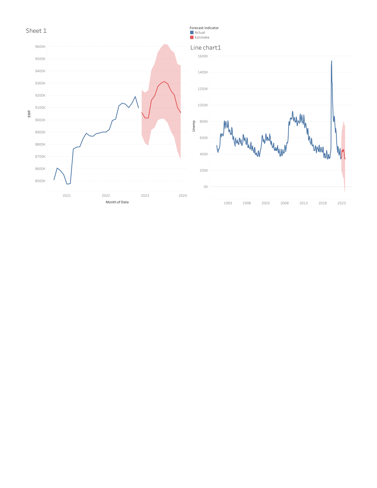
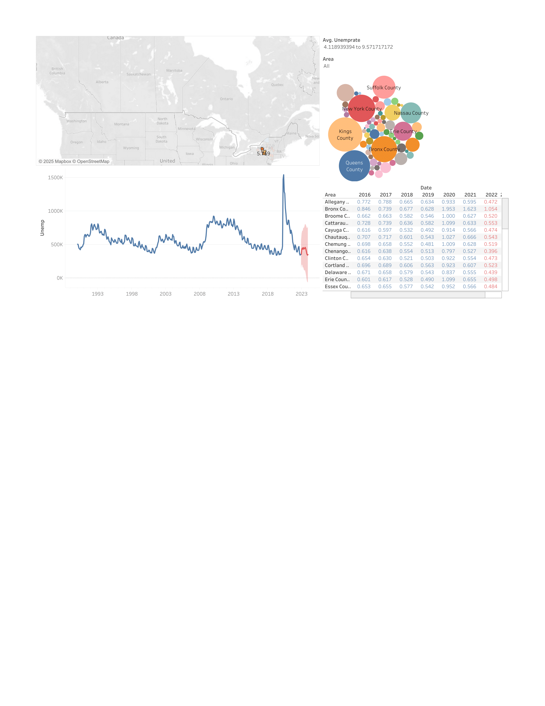

📊 Business Analytics Dashboards  

This repository **`business-analytics-dashboards`** contains my **Tableau dashboards** that showcase business insights, data storytelling, and visualization skills.  

These dashboards are designed to demonstrate my ability to transform raw datasets into clear, actionable insights — an essential skill for **Data Analyst, BI Engineer, and Data Science** roles.  

---

## 📌 Dashboards Included  

### 1. Global Sports Analytics (`jbattu_final.pdf`)  
- Visualizes **player wages, market values, and league distributions** across major countries and leagues.  
- Highlights:
  - Neymar and Ronaldo dominate wages/values.  
  - European leagues hold the largest player market share.  
- Demonstrates **comparative analysis** and **global business insight generation**.  

  

---

### 2. Unemployment Analysis (NY State) (`jbattu_hw.pdf`, `jbattu_hw_2.pdf`)  
- Tracks **unemployment trends (1993–2023)**, with county-level comparisons (Bronx, Erie, Queens, etc.).  
- Includes forecasting to estimate **future employment trends**.  
- Highlights:
  - Clear view of cyclical unemployment patterns.  
  - Predictive insights into job market conditions.  

  
  

---

